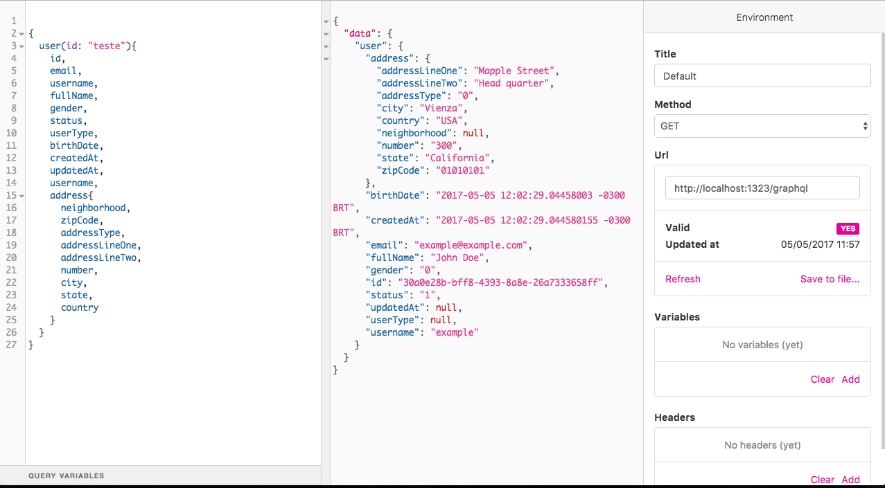

你好！
很冒昧用这样的方式来和你沟通，如有打扰请忽略我的提交哈。我是光年实验室（gnlab.com）的HR，在招Golang开发工程师，我们是一个技术型团队，技术氛围非常好。全职和兼职都可以，不过最好是全职，工作地点杭州。
我们公司是做流量增长的，Golang负责开发SAAS平台的应用，我们做的很多应用是全新的，工作非常有挑战也很有意思，是国内很多大厂的顾问。
如果有兴趣的话加我微信：13515810775  ，也可以访问 https://gnlab.com/，联系客服转发给HR。
# democratic
> Golang skeleton for GraphQL API with Echo framework

[![Go Version][go-version-image]][go-version-url]
[![Build Status][travis-image]][travis-url]
[![Codebeat][codebeat-image]][codebeat-url]
[![License][license-image]][license-url]
[](http://makeapullrequest.com)

It's a small API project based on [Echo framework](https://echo.labstack.com), and GraphQL.
Supports GraphQL queries and GraphQL Mutations. Feel free to contribute!



## Features

- [x] Configuration by enviroment
- [x] Resolvers
- [x] Schemas
- [x] Flag parser
- [ ] Auth middleware
- [x] Metrics with Prometheus

## Requirements

- Govendor
- Golang 1.9

## Installation

#### From source
You can use [Clone from Github](http://github.com/vsouza/democratic) and run `make run`


To set the correct environment you should use: `-e` flag (dev is default)

## Usage example

```
curl -XGET http://localhost:8888/graphql\?query\=%7Buser(id%3A%22test%22)%7Busername%7D%7D
```

## Contribute

We would love you for the contribution to **democratic**, check the ``LICENSE`` file for more info.

## Meta

Vinicius Souza – [@iamvsouza](https://twitter.com/iamvsouza) – hi@vsouza.com

Distributed under the MIT license. See ``LICENSE`` for more information.

[https://github.com/vsouza/democratic](https://github.com/vsouza/democratic)

[go-version-image]:https://img.shields.io/badge/Go%20version-1.7-blue.svg
[go-version-url]: https://golang.org/
[license-image]: https://img.shields.io/badge/License-MIT-blue.svg
[license-url]: LICENSE
[travis-image]: https://img.shields.io/travis/vsouza/democratic/master.svg?style=flat-square
[travis-url]: https://travis-ci.org/vsouza/democratic
[codebeat-image]: https://codebeat.co/badges/68b4c895-96c6-4547-a34f-2f7f9283415c
[codebeat-url]: https://codebeat.co/projects/github-com-vsouza-democratic-master
